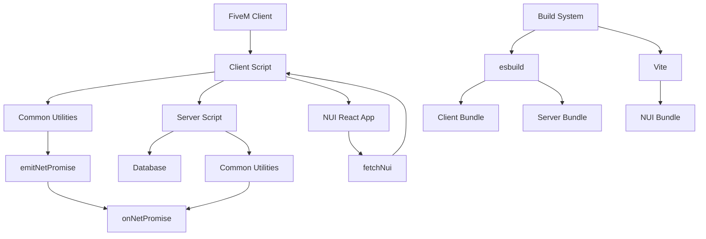
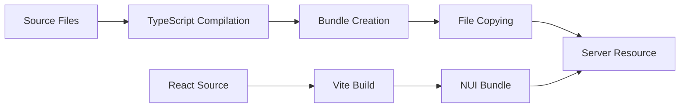
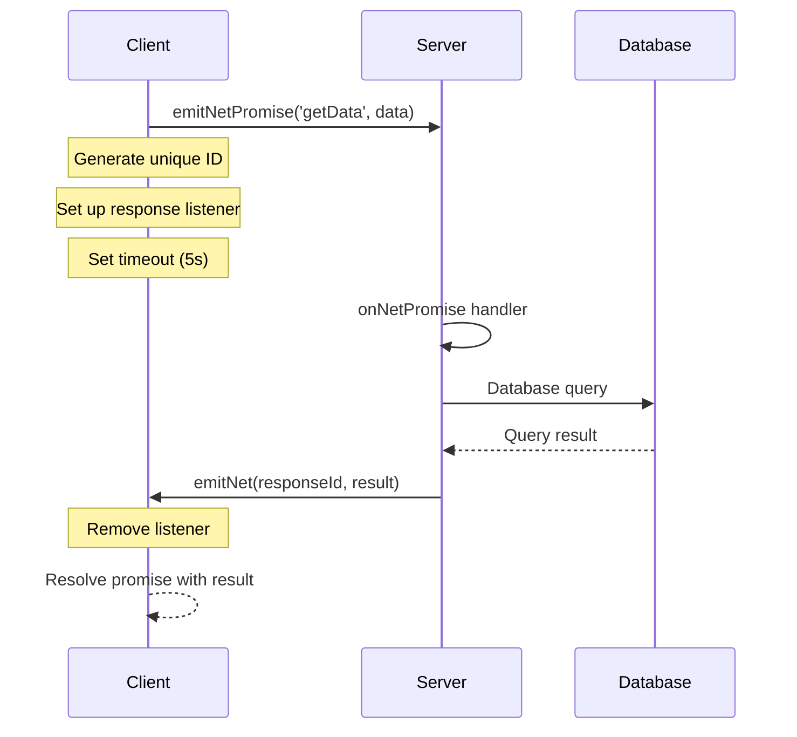
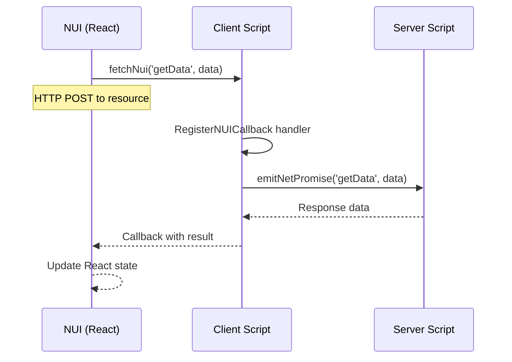

# FiveM TypeScript Boilerplate - Architecture Documentation

This document provides a comprehensive overview of the project architecture, build system, and development patterns used in this FiveM TypeScript boilerplate.

## Table of Contents

1. [Project Architecture](#project-architecture)
2. [Build System](#build-system)
3. [Development Patterns](#development-patterns)
4. [File Structure](#file-structure)
5. [Communication Flow](#communication-flow)
6. [Database Integration](#database-integration)
7. [NUI Architecture](#nui-architecture)

## Project Architecture

### High-Level Overview

```
┌─────────────────────────────────────────────────────────────┐
│                    FiveM Server                             │
├─────────────────────────────────────────────────────────────┤
│  Resources (TypeScript)                                     │
│  ├── Client Scripts (Browser/Game)                         │
│  ├── Server Scripts (Node.js)                              │
│  └── NUI (React/Vite)                                      │
├─────────────────────────────────────────────────────────────┤
│  Database (PostgreSQL + Prisma)                            │
└─────────────────────────────────────────────────────────────┘
```

### Component Relationships



## Build System

### esbuild Configuration

The project uses esbuild for fast TypeScript compilation and bundling:

**Client Build** (`config/esbuild.config.js`):
```javascript
esbuild.build({
  entryPoints: [`${entry}/client/client.ts`],
  outdir: output,
  bundle: true,
  minify: false,
  format: 'esm',           // ES modules for client
  target: ['ES2021'],
  watch: watchConfig('client'),
  plugins: [copyPlugin]    // Copy static files
})
```

**Server Build**:
```javascript
esbuild.build({
  entryPoints: [`${entry}/server/server.ts`],
  outdir: output,
  bundle: true,
  minify: false,
  format: 'cjs',           // CommonJS for server
  keepNames: true,         // Preserve function names for debugging
  target: ['node16'],
  platform: 'node',
  watch: watchConfig('server'),
  plugins: [filelocPlugin] // Required for Prisma __dirname
})
```

### NUI Build System

The NUI uses Vite for React development:

**Vite Configuration** (`resources/example/src/web/vite.config.ts`):
```typescript
export default defineConfig({
  plugins: [react()],
  build: {
    outDir: 'dist',
    emptyOutDir: true,
    rollupOptions: {
      input: {
        main: resolve(__dirname, 'index.html')
      }
    }
  }
})
```

### Build Process Flow



## Development Patterns

### Promise-Based Communication

The boilerplate implements a custom promise-based communication system:

**emitNetPromise** (Client → Server):
```typescript
export const emitNetPromise = <T>(eventName: string, ...args: any[]): Promise<T> => {
  return new Promise((resolve, reject) => {
    const uniqId = uuidv4();
    const listenEventName = `${eventName}:${uniqId}`;
    
    const handleListenEvent = (data: T) => {
      removeEventListener(listenEventName, handleListenEvent);
      if (hasTimedOut) return;
      resolve(data);
    };

    let hasTimedOut = false;
    const timeout = 5000;
    setTimeout(() => {
      hasTimedOut = true;
      removeEventListener(listenEventName, handleListenEvent);
      reject(`${eventName} has timed out after ${timeout} ms`);
    }, timeout);

    onNet(listenEventName, handleListenEvent);
    emitNet(eventName, listenEventName, ...args);
  });
}
```

**onNetPromise** (Server Handler):
```typescript
export const onNetPromise = <T>(
  eventName: string,
  func: (source?: number, ...args: any[]) => Promise<T> | T
): void => {
  onNet(eventName, async (respEventName: string, ...args: any[]) => {
    const src = global.source;

    if (!respEventName) {
      console.warn(`Promise event (${eventName}) was called with wrong struct by ${src}`);
    }

    Promise.resolve(await func(src, ...args)).then((res: T) => {
      emitNet(respEventName, src, res);
    }).catch(err => console.error(`Error in onNetPromise (${eventName}): ${err.message}`));
  });
}
```

### NUI Communication Pattern

**fetchNui** (React → FiveM):
```typescript
export async function fetchNui<T = any>(eventName: string, data?: any, mockData?: T): Promise<T> {
  const options = {
    method: 'post',
    headers: {
      'Content-Type': 'application/json; charset=UTF-8',
    },
    body: JSON.stringify(data),
  };

  if (isEnvBrowser() && mockData) return mockData;

  const resourceName = (window as any).GetParentResourceName ? 
    (window as any).GetParentResourceName() : 'nui-frame-app';

  const resp = await fetch(`https://${resourceName}/${eventName}`, options);
  const respFormatted = await resp.json();

  return respFormatted;
}
```

## File Structure

### Project Root Structure

```
/workspace/
├── .cursor/                    # AI agent documentation
│   ├── rules                   # Project rules for AI
│   └── docs/                   # Comprehensive documentation
├── common/                     # Shared code across resources
│   ├── client/                 # Client-side common utilities
│   │   ├── index.ts           # Client exports
│   │   ├── nui.ts             # NUI utilities
│   │   └── tsconfig.json      # Client TypeScript config
│   ├── server/                 # Server-side common utilities
│   │   ├── index.ts           # Server exports
│   │   └── tsconfig.json      # Server TypeScript config
│   ├── shared/                 # Shared utilities
│   │   ├── emit-net-promise.ts # Promise-based client→server
│   │   ├── on-net-promise.ts  # Promise-based server handler
│   │   └── index.ts           # Shared exports
│   ├── lib/                    # Common libraries
│   │   └── uuidv4.ts          # UUID generation
│   └── utils.ts                # Utility functions
├── config/                     # Build configuration
│   ├── esbuild.config.js      # Main build script
│   ├── nui.config.js          # NUI build script
│   └── index.js               # Config utilities
├── prisma/                     # Database schema
│   └── schema.prisma          # Prisma schema definition
├── resources/                  # FiveM resources
│   └── example/               # Example resource
└── package.json               # Root dependencies
```

### Resource Structure

```
resources/example/
├── fxmanifest.lua             # FiveM resource manifest
├── package.json               # Resource-specific dependencies
└── src/
    ├── client/                # Client-side code
    │   ├── client.ts          # Main client script
    │   └── tsconfig.json      # Client TypeScript config
    ├── server/                # Server-side code
    │   ├── server.ts          # Main server script
    │   └── tsconfig.json      # Server TypeScript config
    └── web/                   # NUI React application
        ├── index.html         # HTML entry point
        ├── package.json       # NUI dependencies
        ├── vite.config.ts     # Vite configuration
        ├── tsconfig.json      # NUI TypeScript config
        ├── tsconfig.node.json # Node TypeScript config
        ├── yarn.lock          # Dependency lock file
        └── src/
            ├── main.tsx       # React entry point
            ├── components/    # React components
            ├── hooks/         # Custom React hooks
            ├── providers/     # React context providers
            └── utils/         # NUI utilities
```

## Communication Flow

### Client-Server Communication



### NUI Communication



## Database Integration

### Prisma Configuration

**Schema Definition** (`prisma/schema.prisma`):
```prisma
generator client {
  provider = "prisma-client-js"
  engineType = "binary" // Required for FiveM bundling
}

datasource db {
  provider = "postgresql"
  url = env("DATABASE_URL")
}
```

### Database Connection Pattern

```typescript
import { PrismaClient } from '@prisma/client';

const prisma = new PrismaClient();

// Connection management
process.on('beforeExit', async () => {
  await prisma.$disconnect();
});

// Error handling
prisma.$on('error', (e) => {
  console.error('Database error:', e);
});
```

### Database Operations

```typescript
// Transaction example
const transferMoney = async (fromId: number, toId: number, amount: number) => {
  return await prisma.$transaction(async (tx) => {
    const fromPlayer = await tx.player.findUnique({
      where: { serverId: fromId }
    });
    
    if (!fromPlayer || fromPlayer.money < amount) {
      throw new Error('Insufficient funds');
    }
    
    await tx.player.update({
      where: { serverId: fromId },
      data: { money: { decrement: amount } }
    });
    
    await tx.player.update({
      where: { serverId: toId },
      data: { money: { increment: amount } }
    });
    
    return { success: true };
  });
};
```

## NUI Architecture

### React Application Structure

```
src/
├── main.tsx                   # Application entry point
├── components/
│   ├── App.tsx               # Main application component
│   └── App.css               # Application styles
├── hooks/
│   └── useNuiEvent.ts        # Custom hook for NUI events
├── providers/
│   └── VisibilityProvider.tsx # NUI visibility context
└── utils/
    ├── fetchNui.ts           # NUI communication utility
    ├── debugData.ts          # Development debugging
    └── misc.ts               # Miscellaneous utilities
```

### NUI State Management

```typescript
// Visibility Provider
const VisibilityProvider: React.FC<{ children: React.ReactNode }> = ({ children }) => {
  const [visible, setVisible] = useState(false);

  useNuiEvent('setVisible', (data: boolean) => {
    setVisible(data);
  });

  if (!visible) return null;

  return <>{children}</>;
};

// Custom hook for NUI events
export const useNuiEvent = <T = any>(action: string, handler: (data: T) => void) => {
  useEffect(() => {
    const eventListener = (event: MessageEvent) => {
      if (event.data.action === action) {
        handler(event.data.data);
      }
    };

    window.addEventListener('message', eventListener);
    return () => window.removeEventListener('message', eventListener);
  }, [action, handler]);
};
```

### NUI Development Workflow

1. **Development**: Use `yarn build-nui <resource>` for NUI-only builds
2. **Browser Testing**: NUI can be tested in browser with mock data
3. **Integration**: Use `fetchNui` for FiveM communication
4. **Production**: NUI is bundled and served by FiveM

## Performance Considerations

### Bundle Optimization

- **Tree Shaking**: esbuild automatically removes unused code
- **Code Splitting**: NUI can be split into chunks if needed
- **Minification**: Can be enabled for production builds
- **Asset Optimization**: Images and static files are copied efficiently

### Memory Management

- **Event Cleanup**: Always remove event listeners
- **Database Connections**: Prisma manages connection pooling
- **NUI Resources**: React components are unmounted when NUI closes

### Development Performance

- **Watch Mode**: Automatic rebuilding on file changes
- **Hot Reload**: NUI supports hot module replacement
- **Fast Compilation**: esbuild provides sub-second build times

## Security Considerations

### Input Validation

```typescript
// Server-side validation
const validateInput = (data: any): boolean => {
  if (typeof data !== 'object' || data === null) return false;
  if (data.length > 1000) return false; // Prevent large payloads
  return true;
};
```

### SQL Injection Prevention

Prisma automatically prevents SQL injection through parameterized queries:

```typescript
// Safe - Prisma handles parameterization
const user = await prisma.user.findUnique({
  where: { id: userId } // userId is automatically escaped
});

// Unsafe - Don't do this
const user = await prisma.$queryRaw`SELECT * FROM users WHERE id = ${userId}`;
```

### NUI Security

- **CSP Headers**: Content Security Policy for NUI
- **Input Sanitization**: Sanitize all user inputs
- **Resource Validation**: Validate all data from NUI

This architecture provides a robust, scalable foundation for FiveM resource development with modern TypeScript tooling and best practices.